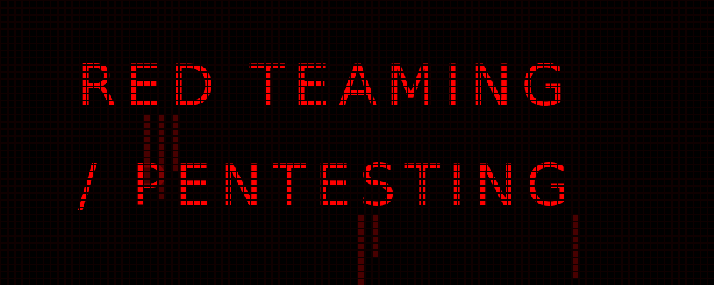

<p align="center">
  
</p>

<p align="center">
  <code>⛤ BLOOD IN THE LOGS ⛤</code>
  <br>
  <rect width='100%' height='100%' fill='%235a0000'/></svg>" width="100%">
</p>

<p align="center">
  <code><a href="#about" style="color:#d30000; text-decoration:none;">[ ⛤about ]</a></code> &nbsp;&nbsp;&nbsp;&nbsp;
  <code><a href="#arsenal" style="color:#d30000; text-decoration:none;">[ ⛤arsenal ]</a></code> &nbsp;&nbsp;&nbsp;&nbsp;
  <code><a href="#forensics" style="color:#d30000; text-decoration:none;">[ ⛤forensics ]</a></code> &nbsp;&nbsp;&nbsp;&nbsp;
  <code><a href="#operations" style="color:#d30000; text-decoration:none;">[ ⛤operations ]</a></code> &nbsp;&nbsp;&nbsp;&nbsp;
  <code><a href="#loot" style="color:#d30000; text-decoration:none;">[ ⛤loot ]</a></code>
</p>

<br>

<table align="center" width="100%">
  <tr>
    <td bgcolor="#000000" style="border: 1px solid #5a0000;">
      <p align="center"><code style="color:#d30000;">⛤ OFFENSIVE SECURITY DIRECTIVE ⛤</code></p>
      <br>
      <p style="color:#a3a3a3;">
        [YOUR CUSTOM MISSION STATEMENT HERE - Example: Execution of advanced adversarial simulations and low-level exploit development. Specializing in web application forensics, supply chain attack vectors, and process injection. The machine has flaws; exploiting its structural defenses is the path to root.]
      </p>
      <br>
      <p align="right">
        
      </p>
    </td>
  </tr>
</table>

<br>

<p align="center">
  
</p>

<rect width='100%' height='100%' fill='%235a0000'/></svg>" width="100%">

<h2 id="operations" style="color:#d30000;">📂 ACTIVE OPERATIONS</h2>

<p align="center">
  
  
</p>

<h3 id="arsenal" style="color:#d30000;">🛠️ TACTICAL ARSENAL</h3>
```text
[Offensive Dev] -> C / C++ / Assembly (x86_64)
[Scripting]     -> Python / Bash
[Host Systems]  -> Fedora Workstation (Primary) / Kali Linux (Tactical)
[Disciplines]   -> Process Injection, LFI/RFI, Buffer Overflows, XSS Bypasses
